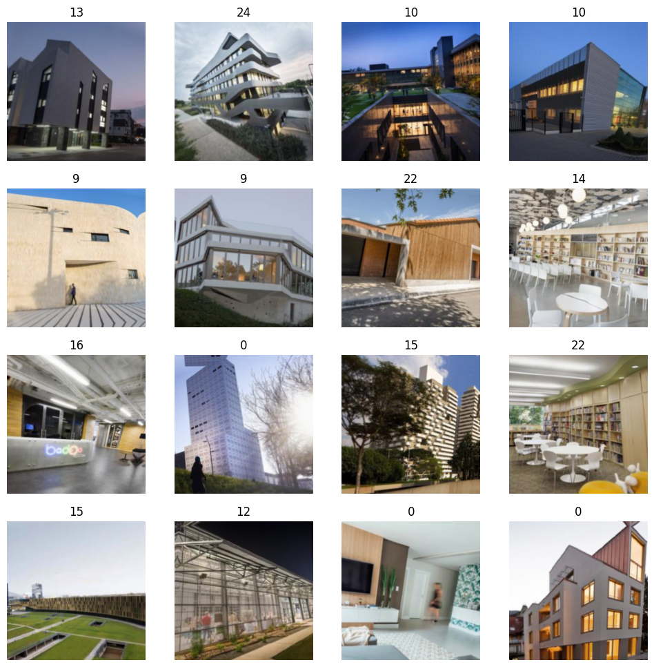

### Why I did this experiments
I've been really interested in X.

### Training my own Neural Network 
I used Google Colab and Jupiter Notebook and used a dataset from Archdaily to train a neural network to predict a building type based on an image. 
I used fast.AI’s library to create datablocks. 
Part of this was to take the categorical data and transform it into numericals - and then associate it with an image. 
I then split the dataset into a training dataset and a validation data set. 
I used Resnet50 which is a convolutional neural network.

 A bunch of code here 

### Building a Reinforcement Learning Algorithm 
A news reading experience that learns your preferred level of summarization based on content category and context, using Q-learning. 
This Flask web application is a sophisticated news content aggregator and distributor, integrating OpenAI's GPT-3 and NewsAPI for dynamic content handling. It fetches, processes, and serves news articles, optimizing its actions based on user feedback and reinforcement learning. The core mechanism involves fetching news from various categories, extracting content, and storing it with a 'served' status. An 'Agent' then selects actions, like generating headlines or summaries, based on the current state, which considers time, category, and user interactions. This Agent uses an epsilon-greedy policy for decision-making, striking a balance between exploring new actions and exploiting known successful ones. User feedback plays a crucial role in refining the system's learning, as it updates Q-values to enhance future content relevance and effectiveness. This design allows the app to adapt over time, offering a responsive and evolving experience in news content delivery.

 A bunch of code here 
